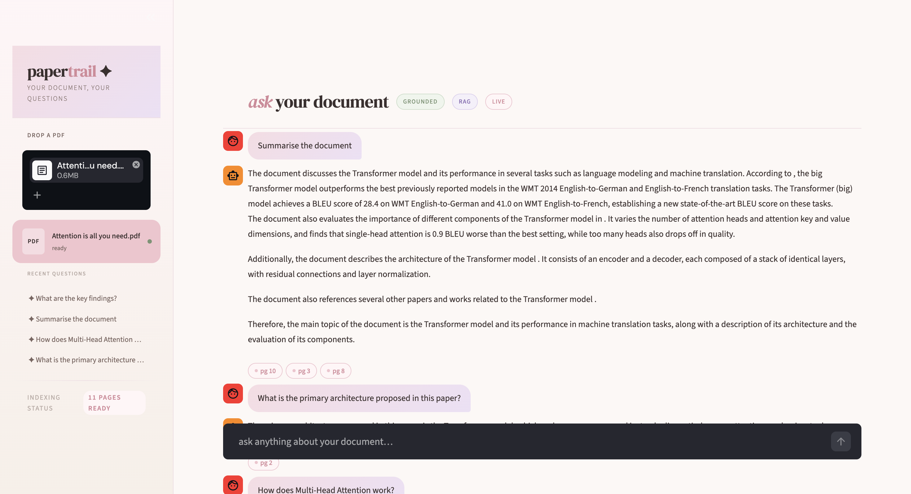

# ✦ papertrail
### *your document, your questions*

> A PDF-constrained conversational agent built with RAG — every answer grounded, every claim cited, every hallucination refused.

---

## ✦ what is this?

**papertrail** is a production-grade conversational AI that lets you chat with any PDF document. It answers questions strictly from the content of your uploaded file — with page citations for every response — and explicitly refuses anything outside the document's scope. 

It has been heavily optimized to run efficiently on low-memory servers ,while maintaining blistering speed and multilingual support.



---

## ✦ how it works

```
PDF upload → extract text (PyMuPDF)
          → chunk into pieces (LangChain RecursiveCharacterTextSplitter)
          → embed via API (Hugging Face Inference API)
          → store in local vector DB (ChromaDB)
          → query time: embed question → retrieve top 3 chunks
          → generate answer (Groq / Llama 3.1) with strict grounding prompt
          → return answer + page citations
```

No outside knowledge. No hallucinations. No guessing.

---

## ✦ tech stack

| Layer | Tool | Why |
|---|---|---|
| PDF Parsing | PyMuPDF | Fast, accurate, preserves page metadata |
| Chunking | LangChain `RecursiveCharacterTextSplitter` | Splits at paragraphs → sentences → words, preserving meaning |
| Embeddings | Hugging Face Inference API | Zero local memory footprint, bypasses 512MB RAM limits |
| Vector Store | ChromaDB | Persists to disk, production-grade |
| LLM | Groq (Llama 3.1) | Fast inference, free tier available |
| UI | Streamlit | Clean, Python-native, with robust try/except error handling |
| Deployment | Docker | Containerized for reliable deployment anywhere |

**Everything in this stack utilizes completely free tiers and highly optimized libraries.**

---

## ✦ getting started

### 1. clone the repo
```bash
git clone https://github.com/saumyajain03/papertrail.git
cd papertrail
```

### 2. install dependencies
```bash
python3.11 -m venv .venv
source .venv/bin/activate
pip install -r requirements.txt
```

### 3. set your API keys
Create a `.env` file in the root directory:
```
GROQ_API_KEY=your_groq_api_key_here
HF_API_KEY=your_huggingface_token_here
```
- Get a Groq key at [console.groq.com](https://console.groq.com)
- Get a Hugging Face token at [huggingface.co/settings/tokens](https://huggingface.co/settings/tokens)

### 4. run the app locally
```bash
streamlit run app.py
```

### 5. deploy via Docker
papertrail includes a production-ready `Dockerfile`. To deploy it locally:
```bash
docker build -t papertrail .
docker run -p 8501:8501 papertrail
```
*(Or simply connect this repository to Render, Railway, or Vercel for automatic deployment using Python 3.11.8)*

---

## ✦ project structure

```
papertrail/
│
├── app.py                        # Main Streamlit UI with robust error handling
├── config.py                     # Chunk size, model names, API key loading
├── requirements.txt              # Pinned requirements (no heavy PyTorch)
├── .env                          # Your API keys (never commit this)
├── Dockerfile                    # Production container setup
├── .dockerignore                 # Excludes .venv and vectorstore/ from builds
├── .python-version               # Pins Python to 3.11.8 for deployment stability
├── project_submission_eval.md    # Test cases for testing the app
│
├── ingestion/
│   ├── loader.py           # PDF text extraction (PyMuPDF)
│   ├── chunking.py         # RecursiveCharacterTextSplitter
│   └── embedding.py        # Connects to Hugging Face API to embed chunks
│
├── retrieval/
│   └── retriever.py        # ChromaDB build + cosine search
│
└── generation/
    └── llm.py              # Groq LLM + grounding system prompt + agentic expansion
```

---

## ✦ architecture decisions

### why Hugging Face API for embeddings?
Initially, the project used local `sentence-transformers`. However, local PyTorch embeddings consume 400MB+ of RAM. On constrained servers like Render's free tier (512MB RAM), this caused immediate Out-of-Memory (OOM) crashes. By securely offloading embedding generation to the free Hugging Face API via `huggingface_hub`, the app's memory footprint dropped to ~250MB, making it completely stable for production without incurring costs.

### why recursive chunking over fixed-size?
Fixed-size chunking cuts sentences mid-meaning. `RecursiveCharacterTextSplitter` tries paragraph → sentence → word boundaries first, so chunks stay semantically coherent. Set at **1000 characters with 200 overlap** to avoid losing context at boundaries.

### why ChromaDB over manual cosine similarity?
Manual NumPy cosine similarity works for small PDFs but loads all embeddings into memory on every run. ChromaDB persists vectors to disk, meaning the PDF doesn't need to be re-embedded on restart. It scales to large documents and is the production-grade choice.

### why robust error handling?
In a production app, unexpected errors (corrupted PDFs, API timeouts, Hugging Face cold starts) should never crash the UI. The application is wrapped in standard `try-except` blocks to display clean UI warnings (`st.error()`) instead of breaking.

---

## ✦ the grounding system prompt

```
You are a document assistant. Answer questions only using the context provided.
For every statement you make, cite the page number in brackets like [Page X].
If the answer is not present in the context, respond with exactly:
"This information is not available in the provided document."
Never use outside knowledge. Never guess.
```

This prompt is non-negotiable — it is what makes the system strictly grounded.

---

## ✦ test cases

### valid queries (should answer with citations)
1. **"What is the primary architecture proposed in this paper?"** 
   * **Expected:** The bot will explain the Transformer model, relying on attention mechanisms instead of RNNs/CNNs, and cite [Page 1] or [Page 2].
2. **"How does Multi-Head Attention work?"** 
   * **Expected:** It will explain that it projects queries, keys, and values in parallel, then concatenates them, citing [Page 4] or [Page 5].
3. **"¿Cuál es la conclusión de este documento?"** *(Bonus Multilingual Test)* 
   * **Expected:** It will fetch the English conclusion chunks and translate its accurate response into perfect Spanish.
4. **"Is paper ka primary architecture kya describe karta hai?"** *(Bonus Hinglish Test)*
   * **Expected:** It seamlessly understands the blended Hindi-English syntax and thoughtfully replies back naturally in Hinglish.

### invalid / out-of-scope queries (should refuse)
*Please test these queries to evaluate our strict anti-hallucination barriers.*
1. **"What is the current stock price of NVIDIA?"**
   * **Expected:** The bot will recognize stock prices aren't present and present a clean visual refusal box.
2. **"Give me a recipe for chocolate chip cookies."**
   * **Expected:** Immediate refusal. The prompt completely lacks semantic relevance to the embedded paper.

---

## ✦ bonus: multilingual support

papertrail handles non-English queries out of the box via Llama 3.1's multilingual capability and the `sentence-transformers/paraphrase-multilingual-MiniLM-L12-v2` embedding model. Ask a question in Hindi, French, or Spanish — the system retrieves the same grounded chunks and responds perfectly in your chosen language.

---

## ✦ contact

Built by **Saumya Jain**

---

*papertrail — because every answer should leave a trail.*
